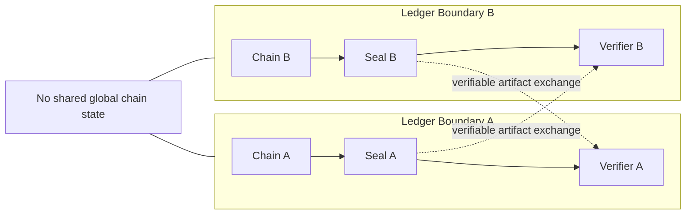

# federation-boundary.md
EventDB Core - Federation Boundary Diagram (Mermaid)
Version: 0.1
Status: Draft

```mermaid
flowchart LR
  subgraph B1[Ledger Boundary A]
    C1[Chain A]
    S1[Seal A]
    V1[Verifier A]
    C1 --> S1
    S1 --> V1
  end

  subgraph B2[Ledger Boundary B]
    C2[Chain B]
    S2[Seal B]
    V2[Verifier B]
    C2 --> S2
    S2 --> V2
  end

  S1 -. verifiable artifact exchange .-> V2
  S2 -. verifiable artifact exchange .-> V1

  N[No shared global chain state]
  N --- B1
  N --- B2
```
