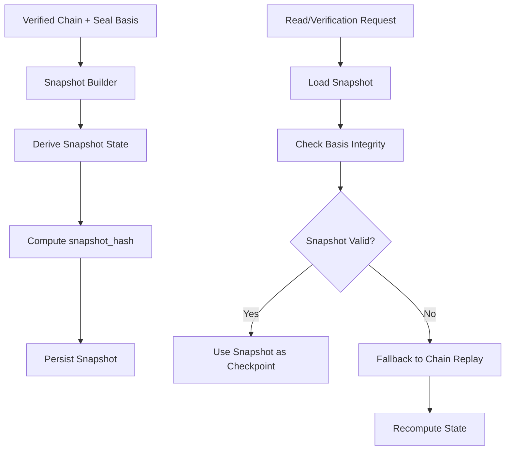

# snapshot-flow.md
EventDB Core - Snapshot Flow (Mermaid)
Version: 0.1
Status: Draft

```mermaid
flowchart TD
  A[Verified Chain + Seal Basis] --> B[Snapshot Builder]
  B --> C[Derive Snapshot State]
  C --> D[Compute snapshot_hash]
  D --> E[Persist Snapshot]

  F[Read/Verification Request] --> G[Load Snapshot]
  G --> H[Check Basis Integrity]
  H --> I{Snapshot Valid?}
  I -- Yes --> J[Use Snapshot as Checkpoint]
  I -- No --> K[Fallback to Chain Replay]
  K --> L[Recompute State]
```
