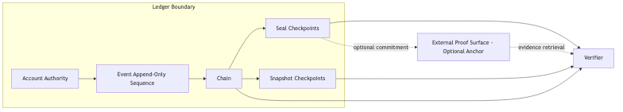
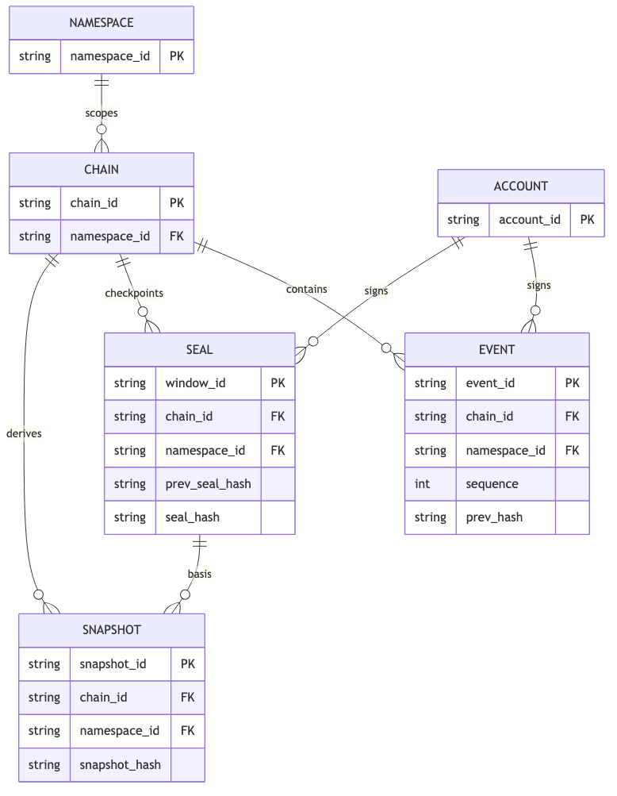
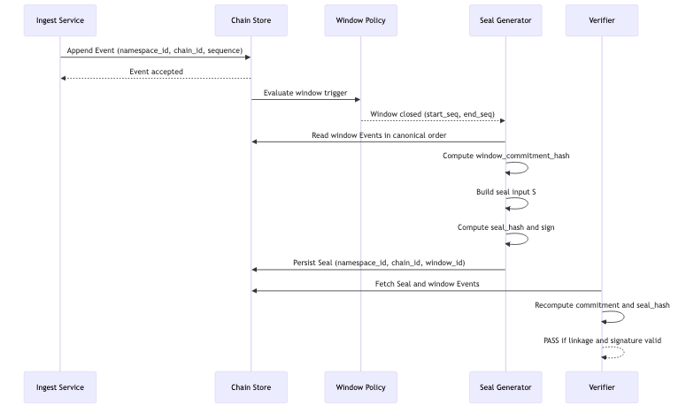
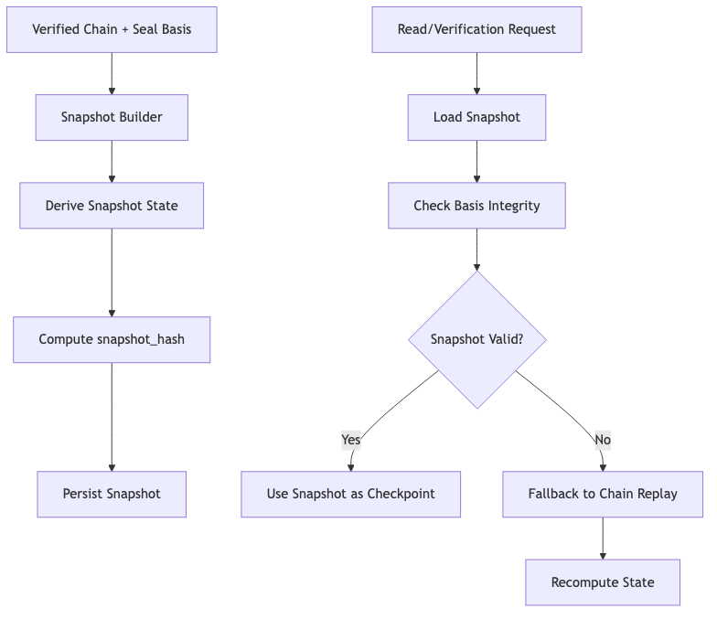
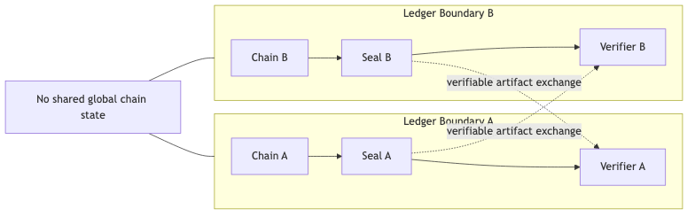

% EventDB Core: Bridging Mutable Enterprise Data and Verifiable History
% Version 0.1
% 2026-03-02

# EventDB Core: Bridging Mutable Enterprise Data and Verifiable History

# 01-abstract.md
EventDB Core - Abstract
Version: 0.1
Status: Draft


Modern enterprise systems are commonly built on relational data stores that permit record mutation through update and delete operations. This model supports operational flexibility, but it weakens the integrity of historical state because past records can be altered after the fact. As a result, many organizations depend on procedural controls, privileged access policies, or partial audit logs that SHOULD improve accountability but do not cryptographically enforce sequence integrity. For systems that require verifiable history, mutable persistence creates a structural gap between operational databases and tamper-evident evidence.

Enterprise resource planning (ERP) environments expose this gap clearly. ERP platforms MUST preserve throughput, governance control, and compatibility with established institutional processes, while public blockchain systems prioritize decentralized consensus, wallet-oriented interaction, and externally priced transaction submission. These assumptions are misaligned for most internal enterprise event flows. A direct migration from ERP data management to full blockchain operation is therefore often impractical, even when integrity requirements are strong.

EventDB Core defines a hybrid event-sourced integrity ledger intended to bridge this gap without replacing existing enterprise systems. The core model treats Event history as append-only, organizes records as a hash-linked Chain, and establishes deterministic verification boundaries for integrity assessment. Sealing introduces periodic cryptographic commitments over verified windows of Events, and optional Anchor publication MAY extend tamper-evident proof beyond the local governance boundary. Anchoring, however, MUST be interpreted as integrity evidence only and MUST NOT be interpreted as business truth, legal validity, or domain fact confirmation.

This framing positions EventDB Core as an integrity-focused layer between mutable enterprise storage and external proof surfaces. It preserves institutional control while enabling deterministic, auditable, and governance-aware verification of historical sequence integrity.

# 02-introduction.md
EventDB Core - Introduction
Version: 0.1
Status: Draft


Enterprise systems require both operational flexibility and verifiable historical integrity. Conventional databases optimize mutable state management, while integrity assurance needs immutable, reproducible sequence verification. EventDB Core addresses this mismatch by defining a deterministic integrity layer that can coexist with institutional systems.

The core model uses append-only Event recording, hash-linked Chain continuity, accountable signatures, periodic Seal checkpoints, and optional external Anchor publication. These mechanisms are designed to provide tamper-evident evidence without requiring full migration to external consensus infrastructure.

EventDB Core is governance-aware. Each institution retains explicit control over Account authority, verification policy, retention obligations, and operational procedures. The model supports federated verification between institutions without requiring a mandatory global ledger.

The scope of this whitepaper is conceptual and architectural. It defines what integrity proof means within EventDB Core and what it does not mean. Integrity proof covers sequence continuity, tamper evidence, and signer accountability. It does not prove business truth, legal validity, or physical-world authenticity.

The specification documents provide normative rules for canonical hashing, signature validation, Chain ordering, window sealing, Snapshot derivation, and Anchor verification. Implementation documents provide storage and operations guidance while preserving logical equivalence requirements defined by the core.

# 03-problem-statement.md
EventDB Core - Problem Statement
Version: 0.1
Status: Draft


Enterprise information systems are generally designed around mutable data stores. This design supports correction, operational agility, and lifecycle management, but it does not provide deterministic guarantees about historical integrity. Records can be updated or deleted, and historical state is often reconstructed from auxiliary artifacts rather than preserved as a cryptographically verifiable sequence. For institutions that require reliable historical evidence, this creates a persistent structural risk: operational systems can process transactions correctly while still failing to prove that prior records were not altered after the fact.

This risk becomes material during audit, dispute resolution, cross-organization reconciliation, and regulatory review. In each context, institutions need more than current-state correctness. They need verifiable continuity of historical records and clear accountability for changes. Traditional controls such as role permissions, approval workflows, and database backups SHOULD remain in place, but those controls are governance mechanisms, not integrity proofs. Where privileged actors can modify both data and metadata, trust remains centralized and historical claims remain difficult to verify independently.

## Limitations of Mutable Databases

Mutable databases are optimized for the latest valid state, not immutable sequence preservation. Four limitations are recurrent.

First, historical reconstruction is indirect. Current tables usually keep final values, while prior values depend on logs or application history structures. This increases complexity and introduces interpretation risk.

Second, continuity is weakly bound. Many systems do not cryptographically link successive records. Without deterministic linkage, reviewers cannot reliably detect selective deletion, silent reordering, or retrospective insertion.

Third, privileged mutation is inherent. Administrators and service accounts need broad access for maintenance and incident response. These capabilities are operationally necessary, but they also create a single-domain trust model that cannot independently prove tamper evidence.

Fourth, multi-system consistency is procedural. Enterprises commonly operate multiple applications with overlapping records. If each application mutates history independently, reconciliation requires manual correlation and judgment, and definitive sequence authority is hard to establish.

These limitations do not imply that mutable databases are unusable. They indicate that mutable databases alone are insufficient where deterministic historical integrity is a primary requirement.

## Weak Audit Trails

Audit trails are widely used to compensate for mutability, yet they are frequently incomplete in scope and uneven in quality.

In many deployments, only selected entities are audited, retention windows differ by subsystem, and change entries are stored without canonical representation. Some logs capture actor and timestamp but not full before-and-after context. Others record deltas that depend on application-specific interpretation.

Even comprehensive audit tables may remain within the same administrative boundary as operational data. If the same privileged domain can alter both records and logs, then audit continuity is not independently enforceable. Storage separation MAY reduce exposure, but without deterministic verification rules, omission and tampering risks persist.

A further issue is ambiguity. Batch correction jobs, migration scripts, and replay mechanisms can produce patterns that resemble unauthorized manipulation. Investigators must then rely on process narratives to interpret logs. This elevates review cost and reduces confidence under contested conditions.

Audit trails therefore SHOULD be treated as observability and accountability support, not as a complete integrity layer. They are necessary but not sufficient for tamper-evident historical assurance.

## Why Full Blockchain Is Often Impractical

Public blockchain infrastructure provides strong tamper-evident properties, but full adoption is often impractical for institutional core systems.

Operationally, enterprise Event volumes and latency constraints may not align with public network confirmation behavior. Core workflows frequently require predictable processing and bounded delays. Public consensus introduces variability that institutions cannot always absorb.

Economically, external fee markets create variable write costs. Institutions generally require budget predictability and controllable operating expenditure for mission-critical systems.

Governance and operations are also misaligned. Wallet-centric key handling, transaction lifecycle tooling, and chain-specific failure modes are not native to many enterprise control environments. Integrating these patterns can be done, but it introduces additional complexity, training burden, and risk.

Data boundary requirements further constrain full migration. Institutions often need strict control over data residency, confidentiality, and access scope. Public publication of business records is typically unacceptable, while private network deployments may reintroduce concentrated trust without automatically resolving integrity semantics.

Therefore, the practical requirement is not total replacement of enterprise databases with blockchain systems. The requirement is an integrity layer that can operate with existing systems while providing deterministic tamper evidence.

## Need for Institutional Governance

Integrity mechanisms in enterprise settings MUST be governance-aware. Technical proofs have limited operational value unless roles, authority, and responsibility are explicit.

Institutions need defined control over Event issuance, Account management, Seal generation, verification duties, and exception handling. Separation of duties SHOULD be explicit to reduce concentration risk and to support independent review.

In federated settings, each institution may maintain its own Chain and policies. Interoperability therefore depends on verifiable evidence across governance boundaries, not on a single mandatory global ledger. Verifiers must be able to determine which institution produced which integrity artifact and under what rules.

Without governance clarity, integrity evidence can exist but still fail to support decisions. Governance is thus a core requirement of the problem, not an optional implementation detail.

## Data Integrity, Business Truth, and Legal Validity

A key conceptual gap in current practice is conflation of data integrity with business truth.

Data integrity concerns whether records are preserved in a tamper-evident, attributable sequence. If a Chain verifies and Seals validate, the system can support bounded claims about sequence continuity and accountability.

Business truth concerns whether recorded content corresponds to real-world events, contractual intent, or factual correctness. Integrity mechanisms do not establish this by themselves. A deterministically preserved sequence can still contain incorrect or fraudulent input.

Legal validity is a separate dimension and MUST remain distinct from both. Legal validity depends on jurisdiction, regulation, contractual context, and procedural compliance outside the integrity layer. Technical evidence MAY support legal analysis, but it does not automatically create legal force.

For this reason, system documentation and governance language MUST keep boundaries explicit:

- Integrity evidence addresses tamper evidence, sequence continuity, and signer accountability.
- Business truth requires domain verification and institutional adjudication.
- Legal validity requires legal interpretation under applicable frameworks.

The central problem addressed by EventDB Core is the absence of a deterministic integrity layer that fits enterprise operational constraints, supports institutional governance, and preserves strict separation between integrity claims, business truth, and legal validity.

## Design Objectives

- The core model MUST preserve append-only Event history with deterministic Chain linkage.
- Verification rules MUST detect tampering, omission, and unauthorized reordering.
- Sealing MUST provide periodic integrity commitments for bounded Event windows.
- Anchoring MAY be used to extend tamper-evident proof beyond local infrastructure and MUST remain optional.
- The architecture MUST support explicit institutional governance boundaries and accountable Account control.
- The specification MUST separate integrity guarantees from business truth assertions.
- The specification MUST separate integrity evidence from legal validity claims.
- The model SHOULD integrate with existing enterprise database environments without requiring full blockchain migration.
- Canonical terminology and deterministic language MUST remain stable across documentation and specification artifacts.

# 04-non-goals.md
EventDB Core - Non-Goals
Version: 0.1
Status: Draft


This section defines explicit non-goals of EventDB Core to preserve architectural clarity and prevent scope drift. EventDB Core specifies a deterministic integrity layer for append-only Event history, accountable signing, and tamper-evident verification. Components or claims outside this integrity scope are out of model boundary.

EventDB Core is NOT a blockchain replacement.
The model does not require or attempt to replicate global consensus behavior as a mandatory baseline. Its purpose is to provide institution-compatible integrity verification within explicit governance boundaries.

EventDB Core is NOT a cryptocurrency system.
It does not define monetary units, issuance mechanics, exchange behavior, or payment-layer incentives. Economic token mechanics are outside core specification scope.

EventDB Core is NOT a tokenization engine.
It does not define representation, issuance, transfer, or lifecycle semantics for tokenized rights or instruments. Asset token models are profile-level concerns and are excluded from core definitions.

EventDB Core is NOT a marketplace.
It does not define participant matching, pricing, settlement negotiation, or market governance functions. Transaction-market design is outside the integrity-layer mandate.

EventDB Core is NOT a legal enforcement tool.
Integrity evidence MAY support legal review, but it does not create automatic legal force, enforceability, or jurisdictional validity. Legal interpretation remains external to core protocol behavior.

EventDB Core is NOT a physical asset authenticity verifier.
The model verifies integrity of recorded digital evidence, not physical state or provenance truth of real-world objects. Physical authenticity requires external attestation, inspection, and domain-specific controls.

EventDB Core does NOT define cross-ledger atomic transaction semantics.
EventDB Core does NOT enforce cross-boundary business state synchronization.

These non-goals preserve the intended positioning of EventDB Core as a bounded integrity architecture. The system provides deterministic tamper-evident history and accountable verification primitives, while business truth, legal validity, market behavior, and physical-world authenticity remain explicitly outside core claims.

# 04-related-work.md
EventDB Core - Related Work
Version: 0.1
Status: Draft


EventDB Core draws from three established design families: event sourcing, append-only audit logging, and cryptographic integrity ledgers. The model adopts deterministic sequence verification from integrity ledger practice while preserving operational compatibility expected in institutional systems.

Event sourcing contributes the principle that state transitions are represented as ordered Events rather than mutable in-place updates. EventDB Core aligns with this principle for integrity evidence but keeps domain semantics outside the core specification.

Traditional audit logging contributes accountability patterns, including actor attribution and timeline reconstruction. EventDB Core extends this by requiring deterministic canonical hashing and linkage checks, reducing dependence on procedural trust alone.

Cryptographic ledger systems contribute tamper-evidence through chained commitments and signed records. EventDB Core applies these properties within institution-governed boundaries and treats external anchoring as optional evidence extension, not as mandatory operational substrate.

Compared with monolithic global-ledger models, EventDB Core prioritizes federation by verification rather than federation by shared state. This distinction supports independent governance while enabling cross-boundary integrity checks.

The resulting architecture is a hybrid integrity layer: event-sourced, append-only, hash-chained, seal-enabled, and blockchain-optional. It is designed to remain minimal, deterministic, and governance-aware.

# 05-design-goals.md
EventDB Core - Design Goals
Version: 0.1
Status: Draft


- The core integrity model MUST be deterministic. Equivalent Event input under the same canonical rules MUST produce equivalent verification outcomes across independent verifiers.
- Hashing, signature, Chain ordering, and Seal verification rules MUST be explicitly defined and MUST NOT depend on implicit runtime behavior.
- Event history MUST be append-only. Existing Event records MUST NOT be rewritten or deleted as part of normal operation.
- Sequence continuity MUST be verifiable through deterministic linkage between Events and between Seals.
- Snapshot mechanisms SHOULD improve verification and read performance, but snapshots MUST NOT rewrite or invalidate prior Chain history.
- Institutional signing MUST be first-class. Each signed Event or Seal MUST be attributable to an accountable Account within an explicit governance boundary.
- Signature validation rules MUST support independent verification by external auditors and peer institutions without requiring privileged database access.
- The federation model MUST be federation-first. Each institution MUST be able to operate its own Chain under local governance without mandatory dependence on a single shared ledger.
- Cross-institution verification SHOULD rely on interoperable integrity artifacts and deterministic verification rules rather than centralized trust assumptions.
- Anchoring MUST be optional. Core integrity guarantees MUST remain valid without Anchor publication.
- When anchoring is used, Anchor evidence MAY strengthen tamper-evident proof across governance boundaries, but it MUST NOT be interpreted as business truth or legal validity.
- The core design SHOULD remain compatible with enterprise SQL environments, including PostgreSQL and MSSQL operational patterns.
- Integrity controls SHOULD minimize disruption to existing transactional systems and SHOULD avoid requiring full blockchain migration.
- Performance characteristics MUST support practical enterprise workloads by separating high-frequency local Event processing from optional external Anchor workflows.
- The specification MUST preserve stable canonical terminology: Event, Chain, Seal, Snapshot, Account, and Anchor.

# 06-architecture-overview.md
EventDB Core - Architecture Overview
Version: 0.1
Status: Draft


EventDB Core defines a layered integrity architecture for enterprise Event history. The architecture is logical and verification-oriented: it specifies how integrity evidence is produced and validated, independent of any single storage engine. The core objective is deterministic tamper evidence with explicit governance boundaries.

This document describes the conceptual and verification layers only. Storage layout, indexing strategy, and vendor-specific persistence patterns belong to implementation documentation and MUST remain outside this overview.

## Ledger Boundary

A ledger boundary defines the scope within which Chain continuity, Seal checkpoints, and Account authority operate.
Each Chain MUST exist within exactly one ledger boundary.
Federation occurs between ledger boundaries.
A ledger boundary MAY correspond to an institution, tenant, or deployment unit.
A ledger boundary MUST NOT be interpreted as domain classification (for example, commodity type or asset class).

## Conceptual Layer

The conceptual layer defines the core semantics of EventDB Core and the boundaries of claims.

- An Event represents an immutable recorded fact within the system boundary.
- A Chain represents the ordered integrity sequence formed by linked Events.
- A Seal represents a cryptographic commitment over a bounded Event window.
- A Snapshot represents a derived checkpoint used to reduce verification or operational cost without rewriting history.
- An Account represents an identifiable signing authority operating under institutional governance.
- An Anchor represents optional external publication of integrity evidence.

At this layer, integrity claims MUST remain bounded: the architecture proves sequence continuity, tamper evidence, and signer accountability. It MUST NOT claim business truth, legal validity, or domain correctness.

## Chain Layer

The Chain layer is the primary continuity mechanism.

Each Event MUST be linked to prior chain state through deterministic hash linkage. This creates a verifiable sequence in which omission, insertion, or reordering attempts can be detected through re-verification. Chain verification MUST produce the same result for all compliant verifiers given identical Event inputs and canonical rules.

The Chain layer also defines accountability boundaries. Events SHOULD be associated with accountable Accounts so that sequence integrity and signer responsibility can be evaluated together. This does not require centralized control across all institutions; it requires explicit governance within each participating boundary.

The Chain layer is logical and independent from physical persistence. A Chain MAY be stored in relational tables, log files, object storage, or hybrid patterns, provided the canonical verification rules are preserved.

## Seal Layer

The Seal layer introduces periodic commitments over bounded segments of Chain history.

A Seal MUST commit to a defined Event window and MUST be verifiable against the corresponding chain segment. Seals SHOULD be generated at operationally meaningful intervals to reduce verification scope for long histories and to produce stable integrity checkpoints.

Seal continuity MUST also be verifiable. Where multiple Seals exist, the sequence of Seals SHOULD support detection of missing windows or inconsistent commitments. Institutional signing of Seals MUST be attributable to accountable Accounts so that integrity checkpoints are auditable within governance policy.

The Seal layer is not a replacement for Event-level verification. It is a compression boundary for integrity evidence. Full verification MAY still require Event-level re-checking where policy demands deeper inspection.

## Snapshot Layer

The Snapshot layer provides derived checkpoints to improve operational efficiency while preserving integrity semantics.

A Snapshot SHOULD summarize verified chain state at a known point so that systems can avoid replaying full history for every read or verification task. However, Snapshot generation MUST be traceable to verified Chain and Seal state, and Snapshot use MUST NOT rewrite prior Event records.

Snapshots are performance artifacts, not authoritative replacements for history. If a Snapshot is missing, stale, or disputed, the underlying Chain and Seal evidence MUST remain sufficient for deterministic re-verification.

This layer enables scale without weakening integrity boundaries: archival and retention policies MAY move historical payloads across storage tiers, but integrity proof continuity MUST remain preserved.

## Anchoring Interface

The anchoring interface defines how integrity evidence can be published to an external proof surface.

Anchoring is optional. Core integrity verification MUST function without any external Anchor. When used, anchoring SHOULD publish bounded commitments (for example, Seal-related evidence) rather than operational payload data. This preserves governance control while extending tamper-evident visibility beyond local infrastructure.

The anchoring interface MUST be implementation-agnostic at the core specification level. Specific Anchor adapters, network choices, and submission procedures are implementation concerns and belong to adapter documentation.

Anchor evidence strengthens tamper-evident claims across boundaries but MUST NOT be interpreted as business truth or legal validity.

## Logical Architecture Versus Storage Implementation

EventDB Core intentionally separates integrity logic from persistence engineering.

Logical architecture defines:

- Canonical Event and Chain semantics
- Deterministic verification behavior
- Seal and Snapshot integrity roles
- Governance-aware signing accountability
- Optional Anchor interaction boundaries

Storage implementation defines:

- Physical data models
- Indexing and partitioning
- Query optimization
- Backup and operational procedures
- Vendor-specific integration patterns

An implementation MAY optimize storage aggressively, but it MUST preserve logical integrity equivalence. If two implementations claim EventDB Core conformance, they MUST produce equivalent verification outcomes for the same Event, Chain, Seal, Snapshot, and Anchor evidence under canonical rules.

This separation ensures portability across enterprise SQL environments while maintaining stable integrity semantics at the core layer.

# 07-core-data-model.md
EventDB Core - Core Data Model
Version: 0.1
Status: Draft


This section defines the conceptual data model of EventDB Core. The model is logical and verification-oriented. It specifies entity meaning, integrity role, and relationships, independent of storage schema or vendor implementation.

## 1. Account

### 1.1 Purpose

Account represents an identifiable signing authority within an institutional governance boundary.

### 1.2 Integrity Role

- Account enables signer accountability for Event and Seal issuance.
- Account identity MUST be stable enough for independent verification.
- Account status and authority scope SHOULD be governed by institutional policy.

### 1.3 Conceptual Notes

Account does not define business ownership or legal entitlement. It defines who produced signed integrity artifacts within the system boundary.

## 2. Chain

### 2.1 Purpose

Chain represents the ordered integrity sequence of Events maintained under a defined governance boundary.

### 2.2 Integrity Role

- Chain preserves sequence continuity through deterministic linkage.
- Chain verification MUST detect unauthorized reordering, omission, or insertion.
- Chain is append-only at the integrity layer.

### 2.3 Conceptual Notes

A Chain may be institution-local in a federation model. EventDB Core does not require a single global Chain.
One ledger boundary MAY contain multiple Chains.
Chains within the same ledger boundary MAY represent different operational partitions.
Partitioning MUST NOT alter canonical verification rules.
Integrity remains evaluated per Chain.

## 3. Event

### 3.1 Purpose

Event is the atomic immutable record unit in the model.

### 3.2 Integrity Role

- Each Event participates in Chain continuity.
- Each Event SHOULD be attributable to an accountable Account.
- Event content is integrity-preserved as recorded input; later correction MUST occur through new Events, not mutation.

### 3.3 Conceptual Notes

Event integrity proves tamper-evident preservation, not business truth. A valid Event sequence may still contain incorrect business assertions.

## 4. Seal

### 4.1 Purpose

Seal represents a cryptographic commitment over a bounded Event window in a Chain.

### 4.2 Integrity Role

- Seal provides checkpoint evidence for a specific sequence segment.
- Seal SHOULD reduce re-verification cost for long histories.
- Seal continuity SHOULD be verifiable across successive windows.

### 4.3 Conceptual Notes

Seal complements Event-level verification. It does not replace full Chain semantics.

## 5. Snapshot

### 5.1 Purpose

Snapshot represents a derived checkpoint of verified chain state used for operational efficiency.

### 5.2 Integrity Role

- Snapshot SHOULD accelerate read or verification workflows.
- Snapshot MUST be derivable from verified Chain and Seal state.
- Snapshot MUST NOT rewrite or invalidate historical Events.

### 5.3 Conceptual Notes

Snapshot is a performance artifact, not a substitute source of historical authority.

## 6. Conceptual Relationships

### 6.1 Account to Event

- One Account MAY issue many Events.
- Each signed Event SHOULD reference one accountable Account at issuance time.
- The relationship establishes authorship accountability, not business ownership semantics.

### 6.2 Chain to Event

- One Chain contains an ordered sequence of Events.
- Each Event belongs to one Chain context for verification.
- Event order within a Chain is integrity-significant and MUST be deterministic.

### 6.3 Account to Seal

- One Account MAY issue many Seals.
- Each Seal SHOULD be attributable to one accountable Account.
- This relationship supports auditable checkpoint authority.

### 6.4 Chain to Seal

- One Chain MAY have many Seals over time.
- Each Seal commits to a bounded Event window within one Chain.
- Seal sequence SHOULD provide continuity across windows.

### 6.5 Chain to Snapshot

- One Chain MAY have many Snapshots.
- Each Snapshot represents derived state at a specific Chain point.
- Snapshot references verified Chain history; it does not replace it.

### 6.6 Seal to Snapshot

- Snapshot generation SHOULD align with verified Seal or chain checkpoint boundaries.
- Snapshots MAY use Seal evidence to reduce replay cost during verification.

## 7. Model Boundaries

- The core data model defines integrity semantics and verification relationships.
- Storage mapping, indexing, partitioning, and physical schema are implementation concerns and are out of scope in this section.
- Conforming implementations MUST preserve these conceptual relationships even when physical models differ.

# 08-event-envelope-and-hashing.md
EventDB Core - Event Envelope and Hashing
Version: 0.1
Status: Draft


This section explains the conceptual structure of the Event envelope and the hashing logic used for deterministic integrity verification. It defines what MUST be stable for verification and why canonical representation is required.

## 1. Conceptual Purpose

The Event envelope is the integrity boundary for one Event in a Chain. It packages identity, ordering context, signer context, and recorded content into a deterministic form that can be hashed and verified independently.

At this layer, the objective is not storage efficiency. The objective is reproducible integrity evidence: the same Event input MUST yield the same hash result across compliant verifiers.

## 2. Event Envelope Field List

A canonical Event envelope MUST include the following logical fields:

- `chain_id`: identifies the Chain context to which the Event belongs.
- `event_id`: identifies the Event within the issuing scope.
- `sequence`: defines deterministic Event order in the Chain.
- `prev_hash`: links the Event to the prior Chain state.
- `account_id`: identifies the accountable Account that issues or signs the Event.
- `event_type`: identifies the declared Event classification.
- `event_time`: records Event issuance time in canonical format.
- `payload`: contains the recorded Event content under canonical serialization rules.
- `signature`: contains the integrity signature over the defined signing input.

Implementations MAY carry additional operational metadata, but non-canonical fields MUST NOT alter canonical hash computation.

## 3. Canonical JSON Rule

Canonical serialization is required before hashing. Equivalent Event meaning MUST map to one canonical byte representation.

Canonical JSON rules SHOULD enforce:

- stable key ordering;
- explicit UTF-8 encoding;
- deterministic number and boolean representation;
- no non-deterministic whitespace;
- deterministic null and empty structure handling.

If two systems serialize semantically identical Event data differently, hash outputs diverge and Chain verification fails. Therefore, canonical JSON is not an optimization detail; it is a core integrity requirement.

## 4. Hash Computation Principle

Hashing in EventDB Core follows a deterministic input-to-digest principle.

- Let canonical envelope bytes be represented as `E`.
- Event hash is defined as `H(E)`.
- The hash algorithm and input scope MUST be fixed by specification.

The model depends on reproducibility, not secrecy. Verifiers MUST be able to recompute Event hash from canonical Event input and reach identical results.

## 5. `prev_hash` Chaining

`prev_hash` establishes continuity across Events in a Chain.

- For each Event after the first, `prev_hash` MUST reference the hash of the previous Event in deterministic order.
- Any unauthorized change to prior Event content changes prior hash output and propagates mismatch forward.
- Reordering or omission attempts break linkage consistency and MUST be detectable during verification.

This mechanism is the minimal structural basis for append-only tamper evidence.

## 6. Why Determinism Is Required

Determinism is required because integrity verification is comparative. Different verifiers, running in different environments, MUST produce the same result from the same input.

Without determinism:

- hash equality becomes environment-dependent;
- chain validity becomes ambiguous;
- audit outcomes become non-reproducible;
- integrity claims lose evidentiary value.

With determinism:

- verification is portable across institutions;
- tamper detection is machine-checkable;
- governance review can rely on bounded, repeatable integrity claims.

Determinism therefore MUST be treated as a non-negotiable property of the Event envelope and hashing model.

Deterministic verification is scoped per Chain within a ledger boundary.
Verification across ledger boundaries requires verifiable artifact exchange and MUST NOT assume shared ordering.

## 7. Formal Specification References

This whitepaper section is conceptual. Normative definitions, required fields, and verification rules are specified in:

- `03-spec/03-event-envelope.md` for envelope field semantics and required scope;
- `03-spec/04-hashing-rule.md` for canonical hashing input and digest rules;
- `03-spec/06-chain-and-ordering.md` for Chain ordering and `prev_hash` verification constraints;
- `05-mvp/scripts/canonical-json.md` for canonical JSON implementation guidance.

Where this overview and formal specification differ, the formal specification MUST take precedence.

# 09-sealing-and-windows.md
EventDB Core - Sealing and Windows
Version: 0.1
Status: Draft


This section defines the conceptual model for Event windows and Seals in EventDB Core. The focus is integrity checkpointing over Chain segments. External anchoring behavior is intentionally out of scope here.

## 1. Purpose of Window

A window is a bounded segment of ordered Events within one Chain. Windowing partitions long Event history into verifiable units that can be processed and reviewed with predictable scope.

Windowing serves four integrity-oriented purposes:

- It defines explicit boundaries for periodic integrity commitments.
- It reduces verification cost compared with full-history replay for routine checks.
- It supports operational checkpoint cadence under institutional governance.
- It improves detectability of omission or discontinuity at segment boundaries.

A window MUST be defined deterministically. All compliant verifiers MUST identify the same Event set for a given window definition.

## 2. Seal Creation Rule

A Seal is a cryptographic commitment over a specific window in a Chain.

Seal creation MUST follow deterministic rules:

- The target window boundary MUST be explicit and reproducible.
- The committed input set MUST include all Events in that window according to Chain order.
- Canonical hashing inputs for Seal computation MUST be stable across verifiers.
- Seal issuance SHOULD be attributable to an accountable Account.

Given identical window contents and canonical rules, independent verifiers MUST compute equivalent Seal outcomes.

## 3. `prev_seal_hash` Linkage

`prev_seal_hash` links each Seal to the preceding Seal in the same Chain context.

- For every Seal after the first, `prev_seal_hash` MUST reference the prior Seal hash.
- Missing or altered Seal records MUST be detectable by linkage break.
- Reordered Seal sequence MUST fail deterministic continuity checks.

This creates a second continuity layer above Event-level `prev_hash` linkage. Event linkage protects intra-window and cross-window sequence integrity at the Event level, while `prev_seal_hash` protects integrity of checkpoint progression.

## 4. Why Sealing Strengthens Integrity

Sealing strengthens integrity by adding periodic, signed commitments over bounded Chain history.

Without Seals, verification can still be performed from Event linkage, but full-history checks may be operationally expensive as Chain length grows. With Seals, institutions can verify checkpoint continuity first, then selectively expand to Event-level verification when required by policy or dispute context.

Seals also improve governance visibility. Because each Seal corresponds to a defined window, review processes can evaluate integrity status at predictable intervals. This supports auditability without changing append-only Event semantics.

Sealing therefore strengthens integrity by improving scalability, detectability, and checkpoint accountability while preserving deterministic verification boundaries.

## 5. Why Sealing Does Not Validate Business Truth

A valid Seal proves bounded integrity properties only:

- the committed window corresponds to deterministic input under canonical rules;
- the Seal chain continuity is intact;
- accountable issuance can be evaluated.

A valid Seal does NOT prove that Event payloads are factually correct, legally enforceable, or complete representations of external reality. Incorrect or misleading business content can still be sealed if it was recorded and processed consistently.

For this reason, Seal verification MUST be interpreted as integrity evidence, not as confirmation of business truth. Domain validation, legal interpretation, and factual adjudication remain outside the Seal model.

Deterministic verification is scoped per Chain within a ledger boundary.
Verification across ledger boundaries requires verifiable artifact exchange rather than shared ordering assumptions.

## 6. Scope Boundary

This section defines only windowing and sealing semantics at the integrity layer. Storage-specific design, transport details, and external publication mechanisms are implementation or interface concerns addressed in other sections.

# 10-snapshot-and-retention.md
EventDB Core - Snapshot and Retention
Version: 0.1
Status: Draft


This section defines the conceptual snapshot and retention model in EventDB Core. The goal is to improve operational scalability while preserving deterministic integrity claims. The focus is logical behavior, not storage engine design.

## 1. Snapshot Purpose

A Snapshot is a derived checkpoint representing verified Chain state at a defined point. It is introduced to reduce repeated full-history replay for routine operations.

The Snapshot purpose is bounded and specific:

- provide a reusable checkpoint for read and verification workflows;
- reduce operational overhead on long Chains;
- preserve deterministic relationship to underlying Event and Seal evidence.

A Snapshot is not an alternative source of truth. The authoritative integrity record remains the append-only Event sequence and its associated Seal continuity.

## 2. Performance Motivation

As Chain length increases, full replay for every validation or state reconstruction becomes progressively expensive. This cost appears in compute usage, latency, and operational complexity.

Snapshot use addresses this by enabling a verifier or service to start from a known verified checkpoint and process only subsequent Events. This approach SHOULD reduce average verification effort while keeping verification semantics intact.

Performance improvement is therefore a design objective, but it MUST remain secondary to integrity equivalence. If a Snapshot is unavailable or disputed, the system MUST still support deterministic verification from underlying Chain evidence.

## 3. Integrity Preservation

Snapshot mechanisms MUST preserve core integrity guarantees.

- Snapshot derivation MUST be traceable to verified Chain and Seal state.
- Snapshot content MUST be reproducible from canonical historical inputs under the same rules.
- Snapshot adoption MUST NOT weaken detection of Event omission, insertion, or unauthorized mutation.

A Snapshot may accelerate verification workflows, but it does not replace the need for verifiable linkage in Events and Seals. Integrity remains rooted in append-only continuity, with Snapshot acting as a computational checkpoint.

## 4. Archival Model: Hot, Warm, Cold

Retention strategy in EventDB Core is conceptualized as tiered archival domains:

- `hot` domain: recent, frequently accessed Event and verification artifacts used by active operational workflows.
- `warm` domain: less frequently accessed but still readily retrievable artifacts for periodic audit and reconciliation tasks.
- `cold` domain: long-term archival artifacts retained primarily for compliance, historical verification, or exceptional review.

Tier placement MAY change over time based on policy, operational demand, and retention obligations. However, tier migration MUST preserve integrity proof continuity. Movement across tiers is a location transition, not a semantic transition.

Retention policy SHOULD optimize cost and accessibility, but it MUST NOT break the ability to reconstruct and verify Chain continuity when required.

## 5. Why Snapshot Does Not Rewrite History

Snapshot is a derived representation of prior verified state, not a mutation mechanism.

- Creating a Snapshot does not alter historical Events.
- Replacing operational reads with Snapshot-based reads does not delete historical evidence.
- Archiving historical payloads does not remove integrity obligations for verifiability.

If a Snapshot differs from recomputed state from the same verified inputs, the Snapshot MUST be treated as invalid or stale. The Chain remains authoritative for dispute resolution.

This separation is essential: Snapshot improves performance, but history remains append-only and tamper-evident through Chain and Seal verification.

## 6. Scope Boundary

This section defines logical snapshot and retention behavior only. Physical storage layout, indexing, replication, and platform-specific archival mechanisms are implementation concerns and are intentionally excluded from this overview.

# 11-anchoring-interface.md
EventDB Core - Anchoring Interface
Version: 0.1
Status: Draft


This section defines the conceptual anchoring interface in EventDB Core. Anchoring is treated as an optional integrity extension that publishes bounded proof artifacts to an external system. It is not a replacement for core Chain and Seal verification.

## 1. What Anchoring Means

Anchoring means publishing a compact integrity commitment derived from verified EventDB Core artifacts to an external proof surface.

In practice, the committed object is typically related to Seal-level evidence rather than full Event payload data. The purpose is to establish externally observable tamper-evident reference points for later verification.

Anchoring does not change local integrity semantics. Local Chain and Seal verification remain the primary integrity mechanism.

## 2. Why Anchoring Is Optional

Anchoring is optional by design.

- Core integrity guarantees MUST remain valid without any external Anchor.
- Institutions with strict boundary or policy constraints MAY operate without anchoring.
- Anchoring SHOULD be enabled only when cross-boundary proof visibility is required.

Making anchoring optional preserves deployment flexibility, governance autonomy, and operational compatibility with enterprise constraints.

## 3. Anchor Payload

Anchor payload is the minimal deterministic data needed to bind external publication to internal integrity state.

Anchor payload SHOULD include:

- identifier of the source Chain context;
- reference to the committed Seal or checkpoint;
- canonical commitment hash (for example, a Seal-derived digest);
- anchor publication metadata required for later lookup and verification.

Anchor payload MUST avoid embedding business-domain payload content unless explicitly required by policy. The interface is for integrity commitments, not business data distribution.

## 4. Verification Process

Anchor verification is a comparison procedure between internal evidence and external publication evidence.

A conforming verification flow SHOULD:

- recompute the expected commitment from local canonical Chain and Seal artifacts;
- retrieve published Anchor evidence from the external system;
- compare expected commitment and published commitment deterministically;
- record verification result with accountable review context.

Verification success indicates consistency between local integrity state and published Anchor evidence at the checked point. Verification failure indicates mismatch, missing publication, or unresolved state divergence and MUST trigger policy-defined investigation.

## 5. External Timestamp Function

Anchoring provides an external timestamp function by associating a published commitment with the external system's recorded publication time.

This function MAY support claims that a specific integrity commitment existed no later than a certain externally observable point. It strengthens temporal evidence across governance boundaries.

External timestamp evidence remains bounded:

- it supports timing evidence for commitment publication;
- it does not prove business event correctness;
- it does not establish legal validity by itself.

## 6. Separation from Business Logic

The anchoring interface MUST remain separate from business logic.

- Anchoring decisions SHOULD be driven by integrity policy, not business workflow side effects.
- Anchor success or failure MUST NOT silently alter business-domain state semantics.
- Business rule evaluation, legal adjudication, and domain truth assessment remain outside anchoring scope.

This separation prevents conceptual drift and preserves the role of anchoring as integrity evidence only.

## 7. Scope Boundary

This section defines logical interface behavior only. Network selection, adapter implementation, submission protocols, and operational retry strategies are implementation concerns and are defined outside this whitepaper section.

# 12-federation-model.md
EventDB Core - Federation Model
Version: 0.1
Status: Draft


This section defines the federated deployment model of EventDB Core. The model is governance-aware and integrity-focused: each institution can operate independently while still supporting cross-boundary verification.

## Ledger Boundary

A ledger boundary defines the scope within which Chain continuity, Seal checkpoints, and Account authority operate.
Each Chain MUST exist within exactly one ledger boundary.
Federation occurs between ledger boundaries.
A ledger boundary MAY correspond to an institution, tenant, or deployment unit.
A ledger boundary MUST NOT be interpreted as domain classification (for example, commodity type or asset class).

## 1. Single Institution Chain

In the base deployment form, one institution operates one or more Chains inside its own governance boundary.

- The institution controls Event issuance, Account authority, Seal policy, and verification operations.
- Integrity claims are local by default and bounded to the institution's accountable scope.
- External parties MAY verify published artifacts when made available, but operational authority remains local.

This model supports deterministic integrity without requiring shared infrastructure across organizations.

## 2. Multi-Institution Federation

In a federation, multiple institutions operate independent Chains and exchange integrity evidence for cross-boundary verification.

- Each institution maintains local governance, signing authority, and operational control.
- Federation interactions focus on verifiable artifacts, not shared mutable state.
- Cross-institution checks SHOULD rely on canonical verification rules and stable terminology.

Federation therefore extends verification reach while preserving institutional autonomy.

## Cross-Boundary Reference Principle

EventDB Core does not define shared state across institutions.
Cross-boundary interaction MUST be based on verifiable artifact exchange.
One institution MAY reference an externally issued Seal or Chain commitment as evidence.
Such reference MUST NOT merge Chains across boundaries.
Cross-boundary verification MUST NOT be interpreted as business acceptance or legal endorsement.

## 3. No Mandatory Global Ledger

EventDB Core does not require a mandatory global ledger.

- Institutions MUST be able to conform to core integrity rules without joining a shared global Chain.
- Federation participation MAY occur bilaterally or in grouped arrangements.
- Global synchronization is not a prerequisite for local integrity validity.

This design avoids forced centralization and supports incremental adoption across heterogeneous governance environments.

## 4. Trust Boundary Concept

A trust boundary defines where technical control, policy authority, and operational accountability are held.

Within one trust boundary:

- Account lifecycle control is local.
- Chain and Seal operations are policy-constrained by the institution.
- Verification and incident response follow local governance procedures.

Across trust boundaries:

- Assertions MUST be supported by verifiable evidence, not implicit trust.
- Evidence interpretation SHOULD be documented and repeatable.
- Disagreement handling requires governance processes outside core integrity mechanics.

Trust boundaries are explicit by design so that verifiers can distinguish local assurance from cross-boundary assurance.

## 5. Optional Consortium Extension

A consortium extension MAY be adopted when a defined group of institutions agrees on shared interoperability and policy constraints.

- Consortium rules MAY define common verification cadence, evidence exchange formats, and dispute workflow.
- Consortium participation MUST NOT remove an institution's local governance responsibility.
- Institutions outside the consortium MUST remain able to run compatible local Chains.

The consortium model is optional and additive. It is not part of minimum EventDB Core conformance.

## 6. Liability Boundary Clarification

Liability boundaries follow governance boundaries and MUST remain explicit.

- Each institution is accountable for the integrity artifacts it issues, signs, and publishes.
- Verification of another institution's artifacts does not transfer authorship or legal responsibility for underlying business content.
- Cross-boundary integrity consistency indicates evidence alignment, not acceptance of business truth or legal position.

Accordingly:

- Integrity responsibility is attributable to the issuing institution.
- Business truth assessment remains domain-governed and institution-specific.
- Legal validity is determined by applicable legal frameworks and is outside automatic integrity inference.

This separation protects technical rigor and clarifies responsibility in federated operation.

# 12-governance-boundary.md
EventDB Core - Governance Boundary
Version: 0.1
Status: Draft


This section defines governance boundaries for EventDB Core with emphasis on accountability, auditability, and liability clarity. The objective is to ensure that technical integrity controls are interpreted within explicit institutional responsibility structures.

## 1. Institutional Responsibility Boundary

Each institution operating a Chain is the primary accountable party for controls within its governance scope. This responsibility includes policy definition, control enforcement, verification oversight, and incident response for locally issued integrity artifacts. Institutions MUST define decision authority for Event acceptance, Seal issuance policy, and exception handling. Institutions MUST maintain evidence that governance controls were applied consistently.

## 2. Operator Responsibility

Operators are responsible for running verification workflows, maintaining service continuity, and escalating integrity anomalies under approved procedures. Operator authority MUST be policy-bounded and auditable. Operational actions affecting Event, Seal, Snapshot, or Anchor processing SHOULD be logged with accountable identity and timestamp context. Operators MUST NOT redefine integrity outcomes outside normative verification rules.

## 3. Key Ownership Responsibility

Key ownership responsibility remains with the institution that authorizes corresponding Accounts. Institutions MUST define key lifecycle controls, including issuance, storage protection, rotation, revocation, and compromise response. Signing authority delegation MUST be explicit and reviewable. A valid signature proves accountable key use under the model, but governance MUST determine whether that use was authorized in organizational terms.

## 4. Data Retention Responsibility

Retention responsibility includes preserving verifiable integrity evidence for required review periods. Institutions MUST retain sufficient Event, Seal, and related verification artifacts to support deterministic re-verification for policy-defined horizons. Tiered archival MAY be used, but migration across hot, warm, and cold domains MUST preserve proof continuity. Retention reduction decisions MUST NOT invalidate required auditability or regulatory evidence obligations.

## 5. Anchor Responsibility

When anchoring is enabled, the issuing institution is responsible for correctness of published commitment mapping to local verified state. Anchor publication policy MUST define cadence, failure handling, reconciliation, and evidence retention. Anchor verification duties MUST be assigned explicitly for both routine and incident conditions. Optional anchoring does not transfer core integrity responsibility away from local Chain governance.

## 6. What Integrity Proof Guarantees

Integrity proof in EventDB Core guarantees bounded technical properties when verification passes:

- deterministic sequence continuity under canonical rules;
- tamper-evidence for covered artifacts;
- attributable issuance through verifiable Account signatures;
- checkpoint continuity where Seals are applicable;
- consistency checks between local commitments and external Anchor evidence when used.

These guarantees are technical and evidence-oriented.

## 7. What Integrity Proof Does Not Guarantee

Integrity proof does not guarantee:

- factual correctness of business content;
- legal enforceability of records;
- regulatory compliance by default;
- authorization legitimacy beyond key possession evidence;
- physical-world authenticity of referenced objects or states.

These determinations require additional governance, legal, and domain controls outside the core integrity layer.

## 8. Liability Separation in Federated Deployment

In federated deployment, liability follows issuing governance boundaries. Each institution is liable for integrity artifacts it generates, signs, stores, and publishes. Verification by a peer institution establishes evidence consistency, not transfer of authorship or legal responsibility for underlying content.

Accordingly:

- local issuance liability remains with the issuing institution;
- cross-boundary verification liability is limited to correctness of the verifier's executed checks;
- shared federation participation does not create automatic joint liability unless established by external legal agreement.

This separation supports transparent accountability while preserving independent governance in multi-institution operation.

# 13-security-and-threat-model.md
EventDB Core - Security and Threat Model
Version: 0.1
Status: Draft


This section defines the conceptual threat model for EventDB Core and maps core mitigations to deterministic integrity controls. The focus is integrity risk in Event history and verification artifacts, not full organizational cybersecurity coverage.

## 1. Security Scope

EventDB Core protects integrity properties through three primary mechanisms:

- hash linkage for tamper-evident sequence continuity;
- signature verification for accountable issuance;
- Seal checkpoints for bounded integrity commitments.

These mechanisms are designed to detect unauthorized modification, omission, or inconsistency in recorded history. They do not replace endpoint security, legal controls, or business process validation.

## 2. Threat: Event Tampering

### 2.1 Threat Description

An attacker modifies Event content after issuance, including payload fields, ordering fields, or signer-related metadata.

### 2.2 Mitigation

- Canonical hashing binds Event content to deterministic digest output.
- Event signature binds signer accountability to defined signing input.
- Re-verification of hash and signature SHOULD detect unauthorized content changes.

### 2.3 Residual Limit

If invalid data is recorded and signed at issuance time, integrity controls preserve that data as-is. They do not prove factual correctness of business content.

## 3. Threat: Chain Rewriting

### 3.1 Threat Description

An attacker attempts to rewrite history by editing prior Events, inserting synthetic Events, or reordering sequence positions.

### 3.2 Mitigation

- `prev_hash` linkage across Events makes unauthorized edits propagate forward as detectable mismatches.
- Deterministic ordering rules make reordering attempts machine-detectable.
- Seal checkpoints provide periodic commitment boundaries that increase rewrite cost and detection likelihood.

### 3.3 Residual Limit

A fully compromised control domain with access to signing keys and operational systems may attempt coordinated falsification. EventDB Core improves detectability but does not eliminate all insider-risk scenarios without governance and monitoring controls.

## 4. Threat: Key Compromise

### 4.1 Threat Description

An attacker gains unauthorized access to an Account signing key and issues seemingly valid Events or Seals.

### 4.2 Mitigation

- Signature verification ensures artifacts are attributable to a specific compromised Account.
- Governance policies SHOULD support key rotation, revocation, and incident-scoped verification review.
- Seal and Chain continuity analysis SHOULD help bound compromise impact windows.

### 4.3 Residual Limit

Cryptographic validity alone cannot distinguish authorized use from unauthorized use of the same key. Key lifecycle governance remains mandatory.

## 5. Threat: Seal Omission

### 5.1 Threat Description

Expected Seal generation is skipped, delayed, or selectively omitted to reduce integrity visibility for certain Event windows.

### 5.2 Mitigation

- Deterministic window policy and expected Seal cadence SHOULD make omission observable.
- `prev_seal_hash` continuity can expose missing checkpoint progression.
- Verification policy SHOULD treat unexpected Seal gaps as integrity incidents requiring investigation.

### 5.3 Residual Limit

Seal omission detection depends on governance-defined schedule enforcement and review discipline. Technical controls alone cannot enforce organizational process compliance.

## 6. Threat: Snapshot Abuse

### 6.1 Threat Description

A stale, manipulated, or selectively generated Snapshot is used to misrepresent current verified state or to conceal historical inconsistencies.

### 6.2 Mitigation

- Snapshots MUST be derivable from verified Chain and Seal evidence.
- Verification workflows SHOULD allow fallback to underlying Event and Seal artifacts.
- Snapshot-to-Chain consistency checks SHOULD be required before trust elevation.

### 6.3 Residual Limit

Snapshot is a performance artifact. If operations rely on Snapshot output without periodic underlying verification, detection latency increases.

## 7. Threat: Anchor Replay Attack

### 7.1 Threat Description

An attacker replays previously valid Anchor evidence in an inappropriate context to imply freshness, continuity, or state equivalence that does not exist.

### 7.2 Mitigation

- Anchor verification MUST bind external evidence to specific Chain and Seal identifiers.
- Verification SHOULD include sequence context and expected checkpoint progression, not hash match alone.
- External timestamp comparison SHOULD be used to detect stale replayed publication claims.

### 7.3 Residual Limit

Anchor evidence confirms publication consistency, not full state freshness or business validity. Policy controls are required to define acceptable staleness and replay handling.

## 8. Protection Limits and Non-Claims

EventDB Core protections are bounded. The model:

- detects many forms of tampering and continuity violation;
- attributes signed artifacts to Accounts;
- supports checkpoint-based integrity verification.

The model does not automatically provide:

- business truth validation;
- legal validity determination;
- endpoint, network, or operator hardening;
- immunity to compromised governance processes.

Accordingly, cryptographic integrity evidence MUST be combined with institutional governance, key management, monitoring, and legal controls.

## 9. Security Posture Summary

EventDB Core SHOULD be interpreted as an integrity assurance layer with deterministic verification guarantees and explicit limitations. Hash, signature, and Seal mechanisms materially improve tamper-evident accountability, while residual risk management remains a governance and operations responsibility.

# 14-performance-and-ops.md
EventDB Core - Performance and Operations
Version: 0.1
Status: Draft


This section outlines operational considerations for running EventDB Core at enterprise scale. The focus is on integrity-preserving performance strategy and operational control boundaries. Recommendations are implementation-agnostic and avoid vendor-specific assumptions.

## 1. Operational Principles

Operational tuning in EventDB Core MUST preserve deterministic verification semantics. Performance improvements are valid only when they keep integrity outcomes equivalent under canonical rules.

Two principles apply throughout:

- optimize execution paths, not integrity definitions;
- separate high-frequency local processing from lower-frequency integrity checkpoint workflows.

## 2. Append-Only Indexing Considerations

EventDB Core uses append-only Event history at the integrity layer. Operational indexing strategy SHOULD reflect this write pattern.

Key considerations:

- Write paths SHOULD favor sequential append behavior to reduce contention.
- Read paths SHOULD prioritize deterministic retrieval by Chain and sequence boundaries.
- Verification workloads SHOULD be able to access contiguous Event segments efficiently.
- Historical search capabilities MAY use additional indexes, but those indexes MUST NOT alter canonical ordering semantics.

Index maintenance cost grows with history depth. Operational policy SHOULD balance query latency targets against write amplification and maintenance overhead.

## 3. Seal Frequency Tradeoff

Seal cadence determines checkpoint density and verification granularity.

Higher Seal frequency:

- SHOULD reduce average verification scope per check;
- SHOULD improve early detection of continuity anomalies;
- MAY increase signing workload and operational overhead.

Lower Seal frequency:

- MAY reduce operational overhead of Seal generation;
- MAY increase replay scope during verification and incident analysis;
- MAY delay visibility of integrity discontinuities between checkpoints.

Seal policy SHOULD be set by governance and risk tolerance. The chosen cadence MUST be explicit, measurable, and enforceable.

## 4. Snapshot Frequency

Snapshot cadence affects replay cost, read latency, and operational consistency.

Higher Snapshot frequency:

- SHOULD reduce average reconstruction latency;
- MAY increase background compute and checkpoint management overhead.

Lower Snapshot frequency:

- MAY reduce checkpoint overhead;
- MAY increase time-to-reconstruct for large Chain segments.

Snapshot policy MUST preserve integrity equivalence:

- Snapshots MUST be derivable from verified Chain and Seal state.
- Snapshot usage MUST allow deterministic fallback to underlying evidence.
- Snapshot lifecycle policy SHOULD define freshness thresholds and invalidation triggers.

## 5. Key Management

Key management is an operational prerequisite for trustworthy signature-based integrity.

Required operational controls:

- Account key ownership and authorization scope MUST be explicit.
- Key rotation and revocation procedures MUST be defined and testable.
- Signing operations SHOULD be auditable with clear responsibility trails.
- Separation of duties SHOULD reduce concentration risk in signing authority.

Compromised key scenarios MUST be operationally rehearsed. Incident handling SHOULD include compromise window identification, artifact re-verification, and governance escalation.

## 6. Backup and Recovery

Backup and recovery policy MUST preserve both data availability and integrity verifiability.

Backup considerations:

- Event, Seal, and related verification artifacts MUST be covered by retention policy.
- Backup cadence SHOULD align with acceptable recovery-point and recovery-time objectives.
- Backup integrity SHOULD be periodically tested through deterministic re-verification exercises.

Recovery considerations:

- Recovery workflows MUST reconstruct a state that can be re-verified under canonical rules.
- Post-recovery checks SHOULD include Chain continuity, Seal continuity, and Snapshot consistency validation.
- Recovery success MUST be defined not only by service availability but also by integrity equivalence.

## 7. Operational Boundary and Non-Claims

Operational controls in this section improve reliability and integrity assurance but do not redefine core claims. EventDB Core operations:

- support deterministic tamper-evident verification;
- improve scalability through checkpoint and retention policy;
- require governance discipline for sustained assurance.

Operational maturity does not convert integrity proof into business truth or legal validity. Those remain separate governance and legal dimensions.

# 19-versioned-sql-read-models-and-optional-blockchain-anchoring.md
EventDB Core - Versioned SQL Read Models and Optional Blockchain Anchoring
Version: 0.1
Status: Draft


This section defines an architectural extension that positions EventDB Core as verifiable infrastructure combining immutable event streams, deterministic projections, SQL read models, and optional cryptographic anchoring.

## 1. SQL Read Model Layer

EventDB Core stores immutable append-only Events in the integrity layer. Query-facing views are produced through deterministic projection from those Events.

Read models MAY be materialized as SQL tables optimized for `SELECT` workloads. These tables exist to improve access patterns for applications, analytics, and reporting, without changing integrity semantics.

Conceptual flow:

`Event -> Projection Engine -> SQL Table -> Query Layer`

Boundary rules:

- Read models are not the source of truth.
- Read models are derived state from the Event stream.
- `INSERT` or `UPDATE` in read tables MUST originate from projection execution.
- Direct manual modification of read tables is prohibited under integrity policy.

Read model utility:

- support indexing for low-latency query paths;
- support joins across domain-oriented query views;
- support reporting and BI integration;
- preserve deterministic rebuild behavior from canonical Event history.

Each read model MUST declare a projection version. Rebuild from Event replay MUST produce equivalent table state for the same projection version and input Event sequence.

Conceptual SQL and projection example:

```sql
-- Query model (derived state)
CREATE TABLE read.orders (
  order_id        text primary key,
  customer_id     text not null,
  status          text not null,
  total_amount    numeric(18,2) not null,
  updated_at      timestamptz not null,
  projection_ver  integer not null
);
```

```text
Projection rule (conceptual):
- on OrderCreated  -> INSERT read.orders
- on OrderUpdated  -> UPDATE read.orders status/total_amount/updated_at
- on OrderCanceled -> UPDATE read.orders status='canceled'
```

```sql
-- Query usage (read path only)
SELECT order_id, customer_id, status, total_amount
FROM read.orders
WHERE status = 'active'
ORDER BY updated_at DESC;
```

## 2. Projection Versioning

Each read model template MUST have an explicit version number. Any change in projection logic, field derivation rule, or normalization behavior MUST increment projection version.

Projection evolution strategies:

- Full rebuild: replay all relevant Events into a new projection version.
- Incremental migration: transform existing read model state with bounded replay and deterministic migration rules.
- Snapshot-assisted rebuild: use verified checkpoints to reduce replay range while preserving deterministic equivalence.

Projection versioning is critical for long-lived enterprise systems because schema and policy evolution is unavoidable. It is also critical in regulatory environments because historical projection logic must remain auditable at specific points in time. Backward compatibility depends on the ability to operate multiple projection versions during transition windows.

## 3. Cryptographic Anchoring (Optional Layer)

EventDB Core is logically immutable by append-only design. However, privileged operators at storage level may still attempt unauthorized modification. EventDB Core therefore supports optional cryptographic anchoring as a tamper-evident integrity layer.

Conceptual mechanism:

- each Event produces a deterministic hash;
- Event hashes form ordered hash-chain continuity;
- at configured intervals, a checkpoint commitment (for example a Merkle root) is generated;
- the checkpoint hash MAY be anchored to an external public blockchain;
- anchoring cadence is policy-configurable.

Anchoring clarifications:

- blockchain anchoring is not required for normal EventDB Core operation;
- anchoring does not replace local verification protocol;
- anchoring provides additional external consistency evidence for integrity checkpoints.

This optional layer is relevant for systems with strict integrity assurance requirements, including financial records, real-asset tokenization records, public sector registries, and other compliance-sensitive domains.

## 4. Layered Architecture (Textual Diagram)

EventDB Core layered model:

- Layer 1 - Event Store (Immutable Log):
  append-only Event persistence, canonical ordering, integrity baseline.
- Layer 2 - Projection Engine:
  deterministic transformation from Event stream to query-oriented state.
- Layer 3 - SQL Read Models:
  materialized relational views optimized for read/query workloads.
- Layer 4 - Application Layer:
  business APIs and application workflows consuming read models and issuing new Events.
- Optional Layer - Blockchain Anchor:
  external publication and verification of checkpoint commitments.

Separation of concerns:

- write integrity is governed by immutable Event recording and verification rules;
- read performance is governed by projection and relational optimization;
- optional external anchoring is governed by publication policy and verification interface.

## 5. Design Principles

- Append-only truth.
- Deterministic projection.
- Read/write separation (CQRS).
- Replayability.
- Tamper-evident integrity (optional).
- Infrastructure neutrality.

## 6. Positioning Statement

EventDB is not a blockchain system, nor merely a database with audit logs.

It is a verifiable event infrastructure capable of supporting enterprise-grade systems with optional cryptographic integrity guarantees.

# 15-roadmap.md
EventDB Core - Whitepaper Roadmap
Version: 0.1
Status: Draft


## Near-Term Objectives

- Stabilize whitepaper sections and remove terminology ambiguity.
- Finalize normative references from whitepaper sections to spec sections.
- Publish first complete diagram set aligned with canonical naming.

## Mid-Term Objectives

- Establish conformance profiles for institution-local deployment.
- Expand federation guidance with interoperability test criteria.
- Publish security review updates tied to threat matrix and error taxonomy.

## Long-Term Objectives

- Release versioned compliance checklist for audit-oriented verification.
- Provide deterministic test vectors for Event, Seal, Snapshot, and Anchor flows.
- Maintain backward-compatible evolution rules for canonical integrity semantics.

Roadmap execution MUST preserve core identity: hybrid, event-sourced, integrity-focused, and governance-aware.

# 16-conclusion.md
EventDB Core - Conclusion
Version: 0.1
Status: Draft


EventDB Core defines a bounded integrity architecture for enterprise Event history. The model provides deterministic tamper-evident verification through canonical hashing, hash chaining, accountable signatures, and periodic sealing, with optional anchor externalization.

The architecture is intentionally separated into conceptual integrity rules and implementation-specific storage concerns. This separation enables interoperability across operational environments while preserving equivalent verification outcomes.

EventDB Core does not claim business truth, legal validity, or physical authenticity. Its contribution is precise: verifiable sequence continuity and accountability under explicit governance boundaries.

Future work SHOULD focus on conformance testing, federation interoperability, and operational hardening without expanding scope into tokenization, marketplace behavior, or non-integrity claims.

# 17-blockchain-anchoring-extension-optional.md
EventDB Core - Section X - Blockchain Anchoring Extension (Optional)
Version: 0.1
Status: Draft
Change Log Reference: 00-admin/PROJECT_MEMORY.md

## Section X - Blockchain Anchoring Extension (Optional)

This section defines an optional extension for external anchor publication. The extension preserves EventDB Core architectural neutrality, keeps ledger boundary sovereignty, and does not modify internal integrity primitives.

### 1. Purpose of Anchoring

Anchoring provides external timestamp evidence for already-verified internal commitments. Anchoring MAY strengthen tamper-evidence credibility in cross-boundary review contexts by publishing commitment hash material only.

Anchoring MUST NOT publish raw Event payload data. Anchoring MUST NOT replace internal Seal integrity.

EventDB integrity verification MUST remain fully functional without anchoring.

### 2. Anchor Commitment Model

Anchoring input MUST be one of the following internal commitment artifacts:

- `seal_hash`; or
- `window_commitment_hash`; or
- `snapshot_hash`.

Raw Event data MUST NOT be used as anchor input.

Anchor commitment is defined abstractly as:

- `Anchor_Commitment = H(seal_hash || anchor_metadata)`.

`anchor_metadata` MAY include:

- `ledger_boundary_id`;
- `anchor_sequence`;
- `anchor_timestamp`.

The commitment model MUST remain blockchain-agnostic.

### 3. External Publication Model

Anchor publication MAY occur through one of the following external publication surfaces:

- public blockchain;
- consortium chain;
- public notarization service;
- time-stamping authority.

EventDB Core does not prescribe chain or provider selection.

### 4. Anchor Verification Semantics

Anchor verification SHOULD follow this sequence:

1. Verify internal Seal integrity.
2. Recompute anchor commitment from internal artifact and declared metadata.
3. Compare recomputed commitment with published anchor record.
4. Verify inclusion proof, if the selected publication surface provides one.

Failure of anchor verification does not invalidate internal ledger continuity. It only weakens external timestamp evidence.

### 5. Sovereignty and Boundary Protection

Anchoring does not merge ledger boundaries. Anchoring does not imply shared state. Anchoring does not create consensus dependency. Anchoring does not introduce cross-ledger synchronization.

Each ledger boundary remains sovereign for internal Chain continuity, Seal policy, and verification authority.

### 6. Policy and Frequency

Anchoring is institution-governed and policy-driven.

Anchoring frequency MAY be configured as:

- per Seal window;
- per day;
- per milestone.

Anchoring MAY be disabled per deployment without affecting internal integrity verification conformance.

### 7. Non-Goals

Anchoring does NOT provide:

- legal enforceability;
- physical authenticity proof;
- regulatory approval;
- automatic dispute resolution;
- distributed transaction atomicity;
- marketplace functionality.

### 8. Diagram (Textual)

```text
[EventDB Ledger Boundary]
          ↓ Seal
          ↓ Anchor Commitment
[External Publication Layer]
          ↓ Optional Verification

Integrity = Internal
Anchoring = External evidence reinforcement
```

### 9. Anchoring Assurance Levels

EventDB Core defines three optional anchoring assurance levels.
All levels are fully compatible with ledger boundary sovereignty.

#### Level 0 - No External Anchoring

Description:

- No external publication.
- Integrity is verified through Event continuity, Seal chain, and Snapshot verification.

Guarantees:

- Tamper-evident internally.
- Deterministic replay is possible.
- No external dependency.

Use Case:

- Internal enterprise deployment.
- Low-risk systems.
- Early pilots.

#### Level 1 - Seal-Level Anchoring

Anchor Object:

- `seal_hash`.

Description:

- Each Seal window produces a commitment hash.
- Commitment is published to an external anchor network.
- Snapshot anchoring is optional.

Guarantees:

- External timestamp evidence.
- Window-level tamper evidence.
- Lightweight operational overhead.

Does NOT Provide:

- Cross-ledger atomicity.
- Shared consensus.
- Legal enforceability.

Recommended For:

- Regulator-facing traceability.
- Agricultural export.
- Nusantara baseline deployment.

#### Level 2 - Seal + Snapshot Anchoring

Anchor Object:

- `seal_hash`.
- `snapshot_hash`.

Description:

- Seal-level anchoring as in Level 1.
- Snapshot state commitments are additionally anchored.

Guarantees:

- Stronger evidentiary reconstruction.
- Faster audit replay.
- State-level external timestamping.

Recommended For:

- Institutional audit infrastructure.
- Compliance-heavy deployments.
- Cross-organization regulatory systems.

#### Level 3 - Multi-Anchor Redundancy

Anchor Object:

- `seal_hash`.
- `snapshot_hash`.
- optional milestone commitments.

Publication Model:

- Multiple external anchor networks.
- Heterogeneous publication (public chain + timestamp authority + consortium).

Guarantees:

- Anti-single-point compromise.
- Maximum external timestamp resilience.
- High-value asset suitability.

Important Constraint:

Level 3 does NOT:

- Merge ledger boundaries.
- Introduce consensus dependency.
- Create cross-ledger state synchronization.
- Replace internal integrity verification.

Recommended For:

- Real World Asset systems.
- High-value commodity chains.
- National infrastructure use cases.

### 10. Safety Statement

Increasing anchoring assurance level strengthens external evidentiary durability but does not alter internal ledger semantics or integrity verification logic.

# appendix-integrity-model.md
EventDB Core - Appendix: Integrity Model
Version: 0.1
Status: Draft


This appendix defines a compact formal model for EventDB Core integrity behavior. The notation is intentionally minimal and is used to express deterministic verification conditions.

## 1. Event Sequence

Let a Chain contain an ordered Event sequence:

- `E1, E2, E3, ..., En`

where `Ei` is the canonical Event envelope at position `i`.
Order is deterministic and append-only at the integrity layer.

## 2. Event Hash Recurrence

Let `H(x)` be the canonical hash function.
Define a genesis value `H0` for chain start.

For `n >= 1`:

- `Hn = H(En || Hn-1)`

Interpretation:

- `Hn` is the cumulative integrity state at Event `n`.
- `En` is canonical Event input.
- `Hn-1` is prior chain integrity state.
- `||` denotes deterministic byte concatenation under canonical encoding rules.

## 3. Seal Recurrence

Let `window_hash_n` be the deterministic commitment hash for Seal window `n`.
Define a genesis Seal value `S0`.

For `n >= 1`:

- `Sn = H(window_hash_n || Sn-1)`

Interpretation:

- `Sn` is Seal chain state at window `n`.
- `Sn-1` enforces continuity between consecutive Seals.

## 4. Tamper Propagation Property

The recurrence model has forward dependency.
If any past input changes, all downstream states change.

Formally:

- If `Ek` is modified for some `k <= n`, then `Hk` changes.
- Because `Hk` is input to `Hk+1`, all `Hi` for `i > k` also change.
- The same applies to Seal continuity: modifying `window_hash_k` or `Sk-1` changes `Sk` and all later `Si`.

This is the tamper propagation property.

## 5. Integrity Verification Condition

A Chain segment passes integrity verification only if all conditions hold:

- each Event is canonical and valid;
- each `prev_hash` corresponds to recomputed prior hash state;
- each Event signature is valid for canonical covered input;
- each Seal recomputes to expected `Sn` and links correctly to `Sn-1`.

Equivalently, verification passes when recomputed recurrence states match recorded recurrence states for the same scope.
Any mismatch is a verification failure.

## 6. Anchor Timestamp Externalization

Anchoring externalizes a selected local commitment (typically Seal-related) to an external system that records publication time.

Conceptually:

- local commitment `C` is published externally;
- external record associates `C` with an external timestamp `T_ext`;
- later verification checks that external `C` equals locally recomputed `C`.

This provides evidence that commitment `C` existed no later than `T_ext` under the external system's timestamp semantics.
It does not establish business truth or legal validity.

# 18-future-development-directions.md
EventDB Core - Future Development Directions
Version: 0.1
Status: Draft
Change Log Reference: 00-admin/PROJECT_MEMORY.md

## X - Future Development Directions (Informative, Non-Normative)

The following areas are identified as potential extensions for future evolution of EventDB Core.
These items are not part of the current normative specification.

### 1. Cross-Boundary Evidence Package (CBEP)

Standardized packaging format for exporting verifiable event subsets across ledger boundaries, including:

- referenced chain headers;
- seal proofs;
- inclusion proofs;
- signature bundles.

Purpose: enable deterministic cross-institution verification without shared database access.

### 2. Reference Link Specification

Formalization of cross-boundary referencing format, including:

- `namespace_id`;
- `chain_id`;
- `event_id`;
- optional seal reference;
- optional anchor reference.

Purpose: standardize inter-ledger references while preserving boundary sovereignty.

### 3. Attestation Event Profile

Generic profile for third-party attestations, including:

- audit reports;
- laboratory results;
- certification evidence;
- notarial statements.

Purpose: structured representation of institutional attestations without altering integrity primitives.

### 4. Dispute and Correction Protocol

Standardized event patterns for:

- dispute declaration;
- correction proposal;
- correction acceptance;
- supersession references.

Purpose: explicit modeling of correction without mutating historical records.

### 5. Snapshot Format Standardization

Specification of minimal interoperable snapshot structure, including:

- snapshot header;
- basis seal reference;
- projection commitment hash;
- optional chunked commitment model.

Purpose: improve portability and bootstrap performance.

### 6. Retention and Pruning Policy Framework

Formal policy model for long-term data lifecycle management while preserving:

- seal continuity;
- verifiable integrity;
- anchor durability.

Purpose: enable sustainable large-scale deployments.

### 7. Selective Disclosure and Commitment Model

Commitment-based payload model allowing:

- partial disclosure;
- redacted payload storage;
- controlled reveal proofs.

Purpose: support privacy-sensitive domains without modifying integrity semantics.

### 8. Key Rotation and Delegation Model

Formal governance model for:

- signing key rotation;
- key revocation;
- delegated signing authority;
- optional multi-signature policy.

Purpose: institutional key lifecycle management.

These future directions aim to strengthen interoperability, governance, and operational resilience while preserving the minimal integrity-first philosophy of EventDB Core.

## Diagram Appendix

### architecture



### data model



### seal window flow



### snapshot flow



### federation boundary



